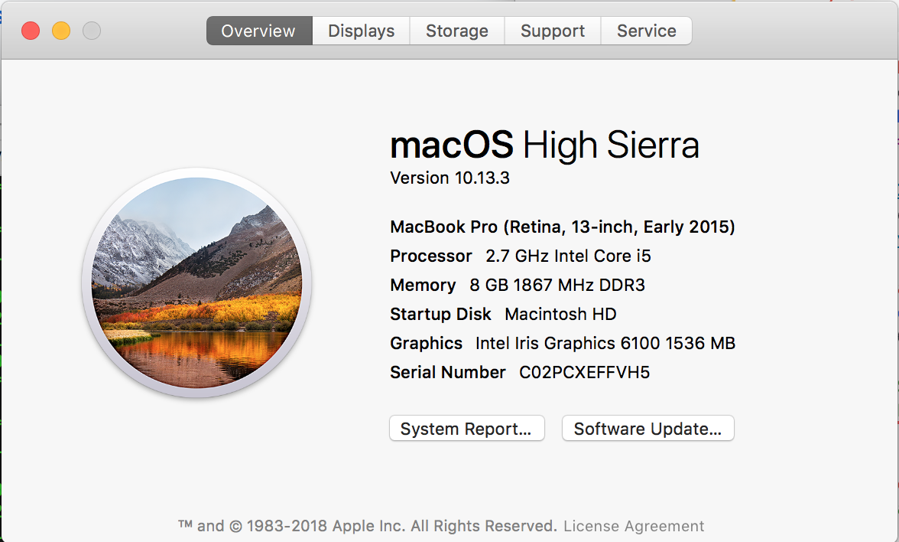
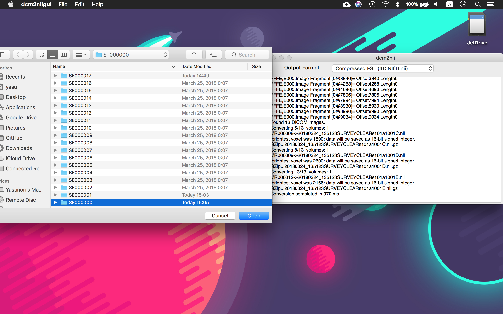
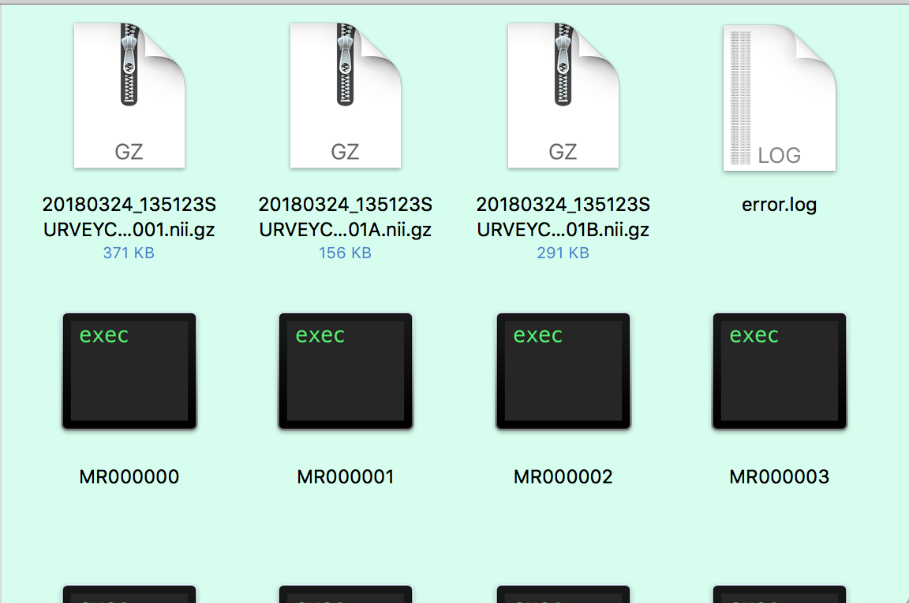

# MRI_analysis
How to analyze the DICOM files from a MRI scan. I had access to a set of MRI scan data, and I wanted to output them to a 3D file to view the innards of the human body. I couldn't get the online tutorials(from instructables and sculpteo- both in the *References* section) working word-for-word, so I will document my steps here. (though it is extremely unlikely that I will once again be analyzing a MRI scan data.)

## my environment


## 1. Convert DICOM to NIFTI
get the latest version of [MRIcron/NPM/dcm2nii](https://www.nitrc.org/frs/?group_id=152). Open the app *dcm2niigui*, and select *File > DICOM to NIFTI*. Navigate to the directory with the data(in my case it was the directories named *SE000000*~*SE000017*), and click *open*.

It should convert the files into something with *.nii.gz* extension.


## 2. analyze and output to 3d file
### [get FreeSurfer](https://surfer.nmr.mgh.harvard.edu/fswiki/MacOsInstall)
must have XQuartz to run, and must execute
```
$ export FREESURFER_HOME=/Applications/freesurfer
$ source $FREESURFER_HOME/SetUpFreeSurfer.sh
```
in the terminal(or write it to ~/.profile) to run the app.
### use FreeSurfer
run `$ recon-all -s output -all -notal-check -i <???.nii.gz> -sd <~/output_directory> -cw256`

Change the stuff inside `< >` to your configuration. It takes time. (The app told me to add options -cw256 and -notal-check to process them properly, but I don't really know what they are for.)

## 3. convert to STL
`$ mris_convert <??.pial> <??.stl>`

## error
[FAQ- FreeSurfer](https://surfer.nmr.mgh.harvard.edu/fswiki/UserContributions/FAQ)
```
Q. Help! I got this error message: "mri_watershed error: GLOBAL region of the brain empty!" - what should I do?

A: Run this:
recon-all -skullstrip -no-wsgcaatlas -s <subjid>

If that goes through without error, you can finish processing your data by running:
recon-all -autorecon2 -autorecon3 -s <subjid>
```

## References
* [FreeSurfer Beginners Guide](https://surfer.nmr.mgh.harvard.edu/fswiki/FreeSurferBeginnersGuide)
* [3D PRINT YOUR OWN BRAIN- -instructables](http://www.instructables.com/id/3D-print-your-own-brain/)
* [How to: 3D print your own brain using MRI or CT scans & free software -sculpteo](https://www.sculpteo.com/blog/2017/11/08/how-to-3d-print-your-own-brain-using-mri-or-ct-scans-free-software/)
